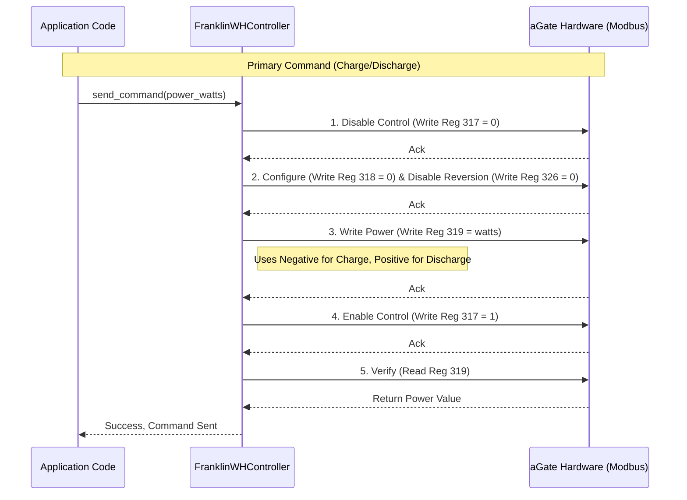
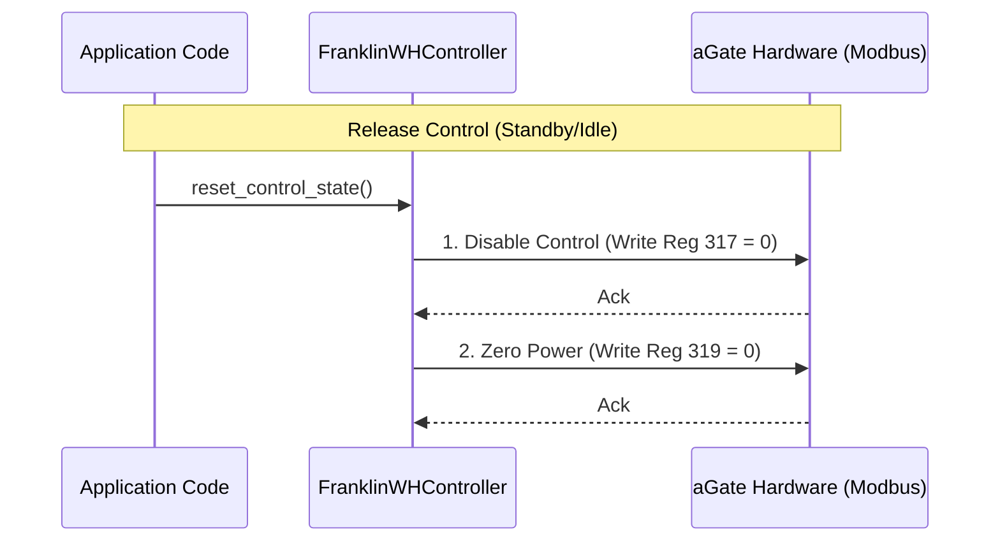
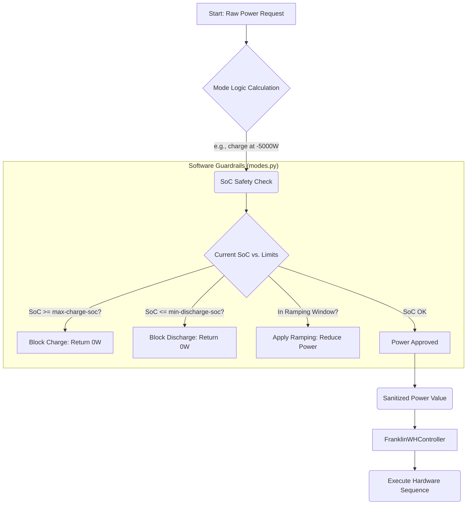

# Battery Control Orchestration & Logic

This document details the hardware interaction sequences and software logic for controlling the FranklinWH aGate battery system.

## 1. Core Hardware Command Sequence

**CRITICAL**: All battery control relies on a mandatory, multi-step sequence of **direct register writes**. High-level `sunspec2` model point writes are ignored by the hardware.

**Sign Convention**:
- **Positive (+) Power**: Discharges the battery.
- **Negative (-) Power**: Charges the battery.

---
## 2. Standby / Release Control Sequence

To return the battery to its native mode, control must be explicitly released.

---
## 3. Software Logic: SoC Limits & Ramping

Before any hardware commands are sent, the `VirtualModeController` calculates and sanitizes the power request based on the following SoC parameters. This entire process occurs within the application and acts as a safety guardrail.

| Parameter | Purpose | Scope |
| :--- | :--- | :--- |
| `target-soc` | The desired SoC for automated modes like Emergency Backup. | Mode-specific |
| `max-charge-soc` | The absolute maximum SoC allowed. Charging is disabled above this. | Global |
| `min-discharge-soc` | The absolute minimum SoC allowed. Discharging is disabled below this. | Global |
| `soc_ramp_window`| The SoC percentage range where power is ramped down to avoid "slamming" into limits. | Global |

### Logic Flow Diagram

