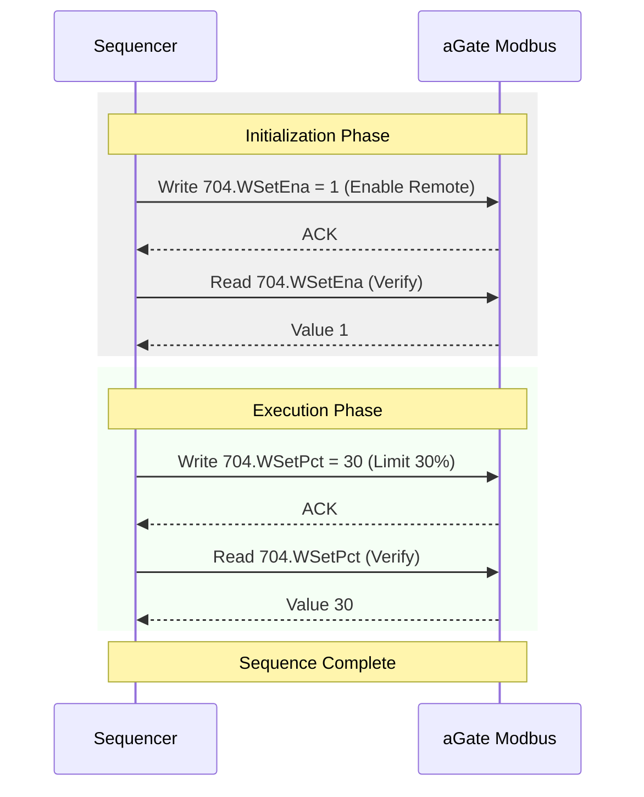

# SunSpec Model Reference

This document provides a detailed map of the SunSpec models implemented in the FranklinWH aGate firmware, cross-referenced with the [PICS Conformance Reference](PICS_CONFORMANCE_CROSS_REFERENCE.md).

## Quick Navigation

| Control Models | Monitoring Models | Settings Models | Extensions |
| :--- | :--- | :--- | :--- |
| [M704 — DER AC Controls](#m704-der-ac-controls) | [M701 — DER Measurement](#m701-der-measurement) | [M702 — DER Capacity](#m702-der-capacity) | [FranklinWH Extensions](#franklinwh-modbus-extensions-15500) |
| [M715 — DER Lifecycle](#m715-der-lifecycle) | [M713 — Storage Capacity](#m713-storage-capacity) | [M703 — Enter Service](#m703-enter-service) | [M1 — Common](#m1-common) |
| [M711 — Freq Droop](#m711-der-freq-droop) | [M714 — DC Measurement](#m714-dc-measurement) | [M502 — Solar Module](#m502-solar-module) | [M705+ Curves](#m705-m712-curves) |

---

## Overview

The aGate utilizes the SunSpec 700-series (IEEE 1547) model set for Distributed Energy Resource (DER) control. 

### Addressing Note
The **native base address** for this implementation is **`1`**. 
*   **SunSpec ID (M1)**: Register 2 (Offset 1 from Base)
*   **700-Series Base**: Typically starts at Offset 69.

### Control Workflow
Most control operations follow a specific sequence managed by the [SunSpec Sequencer](SUNSPEC_SEQUENCER_GUIDE.md):

---

## M1 — Common
**Purpose:** Device identification and firmware metadata.

| Addr | Point | Description | Compliance |
| :---: | :--- | :--- | :---: |
| 2 | ID | Model ID (1) | ✅ |
| 4 | Mn | Manufacturer Name | ✅ |
| 20 | Md | Device Model (aGate X) | ✅ |
| 44 | Vr | Firmware Version | ✅ |
| 52 | SN | Serial Number | ✅ |

---

## M701 — DER Measurement
**Purpose:** Real-time AC grid and inverter telemetry.

| Addr | Point | Description | Compliance |
| :---: | :--- | :--- | :---: |
| 73 | St | Operating State | ✅ |
| 80 | W | Total Active Power (W) | ✅ |
| 82 | Var | Total Reactive Power (Var) | ✅ |
| 83 | PF | Total Power Factor | ✅ |
| 86 | LNV | Phase Voltage (L-N) | ✅ |
| 87 | Hz | Frequency | ✅ |

---

## M702 — DER Capacity
**Purpose:** Hardware ratings and software capacity ceilings.

| Addr | Point | Description | Compliance | Verification Test |
| :---: | :--- | :--- | :---: | :--- |
| 227 | WMaxRtg | Max Active Power Rating | ✅ | — |
| 248 | CtrlModes | Supported Modes Bitfield | ✅ | — |
| **251** | **WMax** | **Active Power Max Setting** | [🔴 BROKEN](PICS_CONFORMANCE_CROSS_REFERENCE.md#m702--der-capacity-settings) | [wmax_conformance.json](examples/diagnostics/wmax_conformance.json) |

---

## M704 — DER AC Controls
**Purpose:** Primary control path for active and reactive power.

| Addr | Point | Description | Compliance | Verification Test |
| :---: | :--- | :--- | :---: | :--- |
| **310** | **WMaxLimPctEna** | **Curtailment Enable** | [🔴 BROKEN](PICS_CONFORMANCE_CROSS_REFERENCE.md#m704--der-ac-controls) | [curtailment_conformance.json](examples/diagnostics/curtailment_conformance.json) |
| **311** | **WMaxLimPct** | **Curtailment Limit (%)** | [🔴 BROKEN](PICS_CONFORMANCE_CROSS_REFERENCE.md#m704--der-ac-controls) | [curtailment_conformance.json](examples/diagnostics/curtailment_conformance.json) |
| **318** | **WSetEna** | **Remote Control Enable** | [✅ WORKING](PICS_CONFORMANCE_CROSS_REFERENCE.md#m704--der-ac-controls) | — |
| **320** | **WSet** | **Power Setpoint (W)** | [✅ WORKING](PICS_CONFORMANCE_CROSS_REFERENCE.md#m704--der-ac-controls) | — |
| **324** | **WSetPct** | **Power Setpoint (%)** | [✅ WORKING](PICS_CONFORMANCE_CROSS_REFERENCE.md#m704--der-ac-controls) | — |
| **331** | **VarSetEna** | **Reactive Power Enable** | [🔴 BROKEN](PICS_CONFORMANCE_CROSS_REFERENCE.md#m704--der-ac-controls) | [reactive_power_conformance.json](examples/diagnostics/reactive_power_conformance.json) |
| **327** | **WSetRvrtTms**| **Dead-man Timer** | [🔴 Issue 4](PICS_CONFORMANCE_CROSS_REFERENCE.md#issue-4--wsetrvrttms-cosmetic-reversion-never-fires-safety) | [reversion_conformance.json](examples/diagnostics/reversion_conformance.json) |

---

## M713 — Storage Capacity
**Purpose:** Battery energy and State of Charge (SOC).

| Addr | Point | Description | Compliance |
| :---: | :--- | :--- | :---: |
| 1035 | WHRtg | Total Energy Rating (Wh) | ✅ |
| 1036 | WHAvail | Available Energy (Wh) | ✅ |
| 1037 | SoC | State of Charge (%) | ✅ |

---

## M715 — DER Lifecycle
**Purpose:** Safety heartbeats and control mode lifecycle.

| Addr | Point | Description | Compliance | Verification Test |
| :---: | :--- | :--- | :---: | :--- |
| 1089 | LocRemCtl | Local/Remote Mode (Read-only) | ✅ | — |
| **1092** | **ControllerHb** | **Controller Heartbeat** | [🔴 BROKEN](PICS_CONFORMANCE_CROSS_REFERENCE.md#m715--der-lifecycle) | [heartbeat_conformance.json](examples/diagnostics/heartbeat_conformance.json) |
| 1095 | OpCtl | Operation Control (Connect/Disconnect) | ⚠️ Untested | — |

---

## FranklinWH Modbus Extensions (15500+)
**Purpose:** Manufacturer-specific registers for operating modes, reserves, and granular telemetry.

These extensions provide access to hardware and software features that are unique to the FranklinWH ecosystem and are not part of the standard SunSpec Modbus Models. 

*   **Granularity**: While some registers (like Solar Power) may appear as duplicates of SunSpec points, the extensions often provide more granular data (e.g., distinguishing between proximal and remote PV sources).
*   **System Control**: Core system settings like Operating Mode and SOC Reserves are managed exclusively through these extension registers.

| Addr | Point | Description | Compliance |
| :---: | :--- | :--- | :---: |
| 15500 | PVUse | PV Installed (Native) | ✅ |
| 15501 | apBoxPVUse | Remote PV Installed | ✅ |
| 15502 | PVOutputP | **Total PV Power (W)** | ✅ |
| 15503 | proximalPVOutputP | Proximal PV Power (W) | ✅ |
| 15504 | Remote1PV | Remote 1 PV Power (W) | ✅ |
| 15505 | Remote2PV | Remote 2 PV Power (W) | ✅ |
| 15506 | LoadActiveP | **Home Load Power (W)** | ✅ |
| 15507 | OnGridMode | Operating Mode (TOU, Self-Consum, etc) | ✅ |
| 15508 | SelfReserve | Self-Consumption SOC Reserve (%) | ✅ |
| 15509 | TouReserve | TOU SOC Reserve (%) | ✅ |
| 15510 | PVOutputWh | **Total PV Generation (Wh)** (High/Low) | ✅ |
| 15512 | proximalOutputWh | Proximal PV Generation (Wh) (High/Low) | ✅ |

---

## M705–M712 Curves
**Purpose:** Autonomous grid response curves (Volt-Var, Volt-Watt, Frequency Droop).
*   **Status:** Most curve models are readable but writes have not been verified. 
*   **Reference:** See [PICS Conformance](PICS_CONFORMANCE_CROSS_REFERENCE.md) for details on specific unimplemented curve registers.

---

## Conformance Tracking Suite

The following diagnostic sequences are designed to test the functional status of the "Broken" or "Unimplemented" registers listed above. Running these sequences will immediately report whether the hardware has been updated to support these standard SunSpec features.

| Test Name | File Path | Targeted Issue |
| :--- | :--- | :--- |
| **Curtailment Test** | [curtailment_conformance.json](examples/diagnostics/curtailment_conformance.json) | Active Power limits discarding writes. |
| **Reactive Power Test** | [reactive_power_conformance.json](examples/diagnostics/reactive_power_conformance.json) | Var setpoints discarding writes. |
| **Heartbeat Test** | [heartbeat_conformance.json](examples/diagnostics/heartbeat_conformance.json) | Safety heartbeat discarding writes. |
| **Capacity Test** | [wmax_conformance.json](examples/diagnostics/wmax_conformance.json) | M702.WMax ceiling discarding writes. |
| **Safety Reversion Test** | [reversion_conformance.json](examples/diagnostics/reversion_conformance.json) | Dead-man timer countdown with no physical reversion. |
