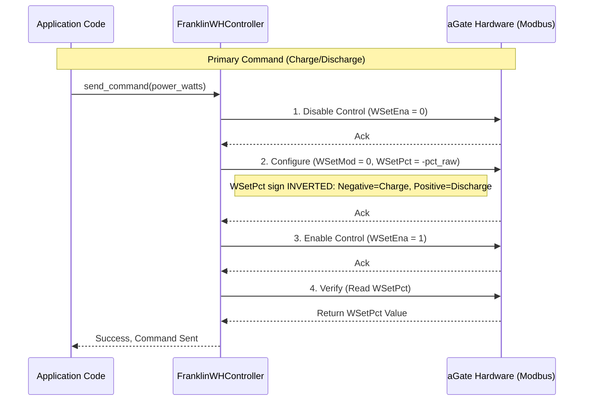
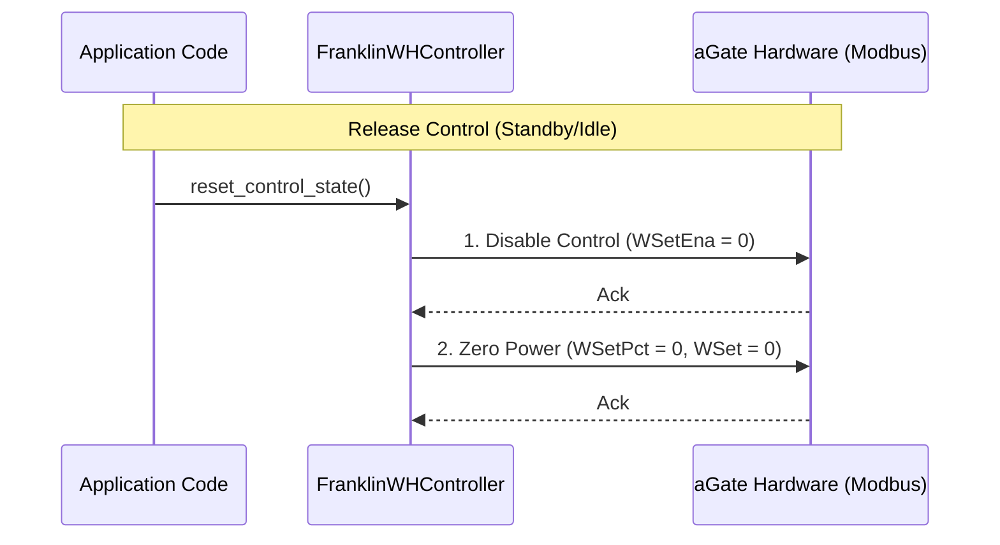
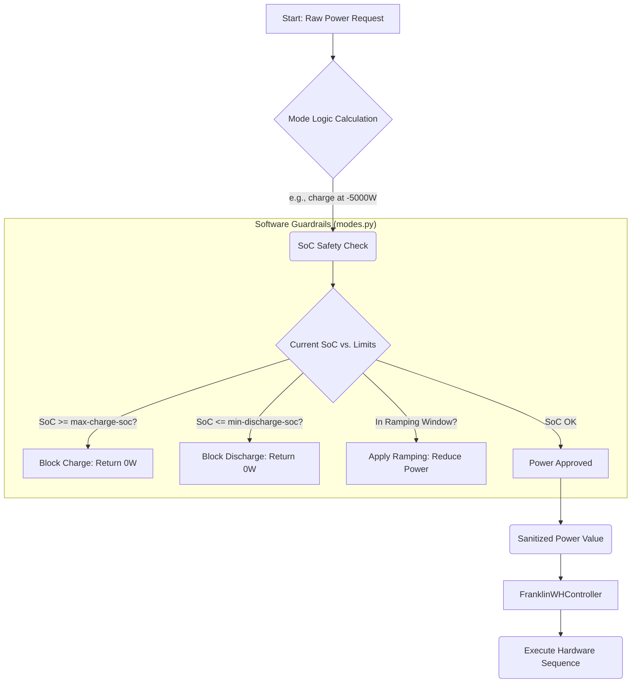

# Battery Control Orchestration & Logic

This document details the hardware interaction sequences and software logic for controlling the FranklinWH aGate battery system.

## 1. Core Hardware Command Sequence

**CRITICAL**: All battery control relies on a mandatory, multi-step sequence of **SunSpec model point writes**. The library uses Model 704 via `sunspec2` model access.

> See [DER_CONTROL_REFERENCE.md](./DER_CONTROL_REFERENCE.md) for the complete register map and test status.

**Sign Convention**:
- **Positive (+) Power**: Discharges the battery.
- **Negative (-) Power**: Charges the battery.



---
## 2. Standby / Release Control Sequence

To return the battery to its native mode, control must be explicitly released.



---
## 3. Software Logic: SoC Limits & Ramping

Before any hardware commands are sent, the `VirtualModeController` calculates and sanitizes the power request based on the following SoC parameters. This entire process occurs within the application and acts as a safety guardrail.

> [!IMPORTANT]
> **Software ramp ≠ Hardware ramp.** The `--soc-ramp-window` CLI option is a **software-side SoC proximity ramp** (implemented in `modes.py`). The hardware `WRmp` register (M704, addr 40345) is **unimplemented** on FranklinWH — all writes are silently discarded. The software ramp works correctly; the hardware ramp does not exist.

| Parameter | Purpose | Scope |
| :--- | :--- | :--- |
| `target-soc` | The desired SoC for automated modes like Emergency Backup. | Mode-specific |
| `max-charge-soc` | The absolute maximum SoC allowed. Charging is disabled above this. | Global |
| `min-discharge-soc` | The absolute minimum SoC allowed. Discharging is disabled below this. | Global |
| `soc_ramp_window`| The SoC percentage range where power is ramped down to avoid "slamming" into limits. | Global |

### How SoC Ramping Works

When SoC enters the ramp window near a limit, the software **linearly reduces power** to prevent overshoot:

```
Example: --charge 5000 --max-charge-soc 100 --soc-ramp-window 10

SoC 85% → Full power (5000W)
SoC 90% → Ramp starts (window = 100% - 10% = 90%)
SoC 95% → Half power (2500W)   ← 50% into ramp window
SoC 99% → Minimal power (500W) ← 90% into ramp window
SoC 100% → Block charge (0W)    ← at max-charge-soc
```

This is purely **software logic** — the power value sent to `send_command()` is reduced. The aGate hardware has no awareness of SoC ramping.

### Logic Flow Diagram


---

## 4. Operational Entry Points & Orchestration Mapping

The following table maps user-facing actions to their underlying orchestration and hardware sequences.

| User Action | Entry Point | Controller Call | Hardware Sequence (Model 704) |
| :--- | :--- | :--- | :--- |
| **CLI/TUI Charge** (`--charge W` or 'c') | `franklinwh_cli.py` / `monitor.py` | `ctrl.send_command(W)` | 1. WSetEna=0 (Stop) <br> 2. WSetMod=0, WSetPct=-pct (Config) <br> 3. WSetEna=1 (Enable) |
| **CLI/TUI Discharge** (`--discharge W` or 'd') | `franklinwh_cli.py` / `monitor.py` | `ctrl.send_command(W)` | 1. WSetEna=0 (Stop) <br> 2. WSetMod=0, WSetPct=+pct (Config) <br> 3. WSetEna=1 (Enable) |
| **CLI/TUI Standby** (`--standby` or 's') | `franklinwh_cli.py` / `monitor.py` | `ctrl.send_command(0)` | 1. WSetEna=0 (Stop) <br> 2. WSetMod=0, WSetPct=0 (Config) <br> 3. WSetEna=1 (Enable) |
| **CLI/TUI Stop / Release** (`--stop` or 'r') | `franklinwh_cli.py` / `monitor.py` | `ctrl.reset_control_state()` | 1. WSetEna=0 <br> 2. WSetPct=0, WSet=0 |
| **Function Call** (Python API) | `controller.py` | `send_command(cmd, duration_s=N)` | Via sunspec2 model point writes |
| **Virtual Mode** (`--mode X`) | `modes.py` -> `set_mode` | `ctrl.send_command(...)` | Repeated updates based on SoC/Target logic |

---
## 5. Software Command Timeout

> [!IMPORTANT]
> Hardware reversion (`WSetRvrtTms`) does **NOT** work on FranklinWH — the aGate accepts the value but never starts the countdown. See [FRANKLINWH_SUNSPEC_QUIRKS.md](./FRANKLINWH_SUNSPEC_QUIRKS.md) for details.

The library provides a **software-side timeout** via `threading.Timer`:

```python
from franklinwh_modbus import FranklinWHController
from franklinwh_modbus.types import BatteryCommand

ctrl = FranklinWHController('192.168.0.110')
ctrl.connect()

cmd = BatteryCommand(power_watts=3000, mode='charge')

# Auto-resets to cloud control after 3600 seconds (1 hour)
ctrl.send_command(cmd, duration_s=3600)

# Check timer status
status = ctrl.get_command_timer_status()  # {'active': True, 'interval_s': 3600}

# Cancel timer manually
ctrl.cancel_command_timer()
```

**CLI equivalent:** `--revert 3600`

**Safety properties:**
- New commands cancel any existing timer first
- Timer thread is daemon (won't block app exit)
- Thread-safe via `_command_timer_lock`
- `--status` shows timer state when active

---
## 6. Register Reference (Model 704)

| Register | Address | Name | Type | Unit | Description |
| :--- | :--- | :--- | :--- | :--- | :--- |
| `WSetEna` | 40318 | Active Power Enable | enum16 | — | 0=Disabled, 1=Enabled |
| `WSetMod` | 40319 | Active Power Mode | enum16 | — | 0=Normal |
| `WSetPct` | 40324 | Active Power % | int16 | % | **Sign inverted:** +discharge, -charge |
| `WSet` | 40320 | Active Power (W) | int32 | W | ⚠️ Avoided (causes flickering) |
| `WSetRvrtTms` | 40327 | Reversion Timeout | uint32 | sec | ⚠️ **Non-functional** on FranklinWH |
| `WSetRvrtRem` | 40329 | Reversion Remaining | uint32 | sec | ⚠️ **Never counts down** |

> See [DER_CONTROL_REFERENCE.md](./DER_CONTROL_REFERENCE.md) for the complete M704 register map (48 fields).

---

*Last Updated: 2026-03-08*
