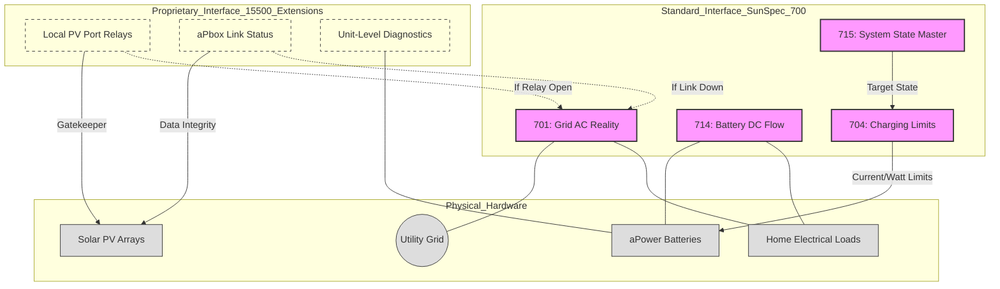

# SunSpec 700-Series Interoperability Guide

This document defines how the FranklinWH aGate orchestrates complex energy use cases by interlinking multiple SunSpec Alliance Information Models (IM). 

## 1. Use Case to Model Mapping

| Use Case | Primary Model(s) | Role |
| :--- | :--- | :--- |
| **Islanding / Grid State** | **IM 701** | Monitors `ConnSt` to detect Utility Outage vs. Connected states. |
| **Solar Harvesting** | **IM 502** | Authoritative for PV DC generation and module-level health. |
| **Battery Management** | **IM 713 / 714** | `SoC`, `SoH`, and real-time DC power flow. |
| **Active Power Control** | **IM 704 / 715** | Orchestrates charging/discharging limits and DER operational modes. |
| **System Diagnostics** | **IM 1 / 715** | Aggregates `Alrm` bitfields and `St` (Status) enumerations. |

## 2. End-to-End Orchestration Architecture

This diagram illustrates the relationship between the Public Standard (SunSpec) and Private Manufacturer (15500 Extensions) layers.

## 3. Key Operational Scenarios

### 3.1 Solar Sponge (Charge from Excess PV)
- **Monitoring**: Read `IM 502` (PV Watts) and `IM 701` (Grid Watts).
- **Logic**: If `IM 701` W > 0 (Exporting), increase charge limit in `IM 704`.
- **Validation**: Confirm `IM 714` (Battery DC) shows increasing negative Watts (Charging).

---
**Baseline Reference**: SunSpec DER Information Model Specification V1.2
**Implementation Context**: FranklinWH aGate Firmware V10R01+
