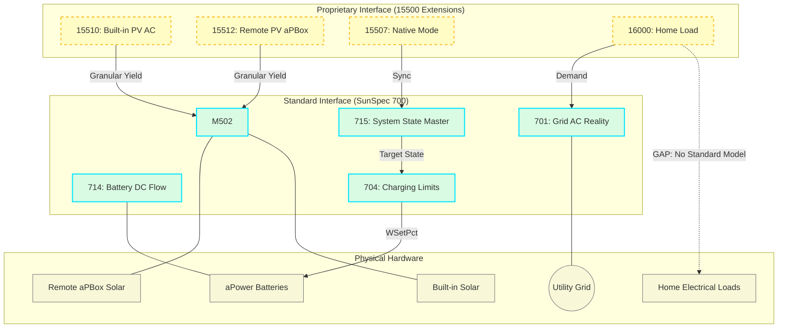

# SunSpec 700-Series Interoperability Guide

*Last Updated: 2026-05-15 18:57*

**Baseline Reference**: SunSpec DER Information Model Specification V1.2  
**Publication Date**: 2020-03-24  
**Version**: 1.2 (Chapter 7: DER Storage, Chapter 8: DER Monitoring)

## 1. Workarounds & Hardware Deviations

The FranklinWH aGate implementation contains several deviations from the SunSpec DER V1.2 standard. Our implementation compensates for these via the following software-side logic:

| SunSpec Point | aGate Deviation | Software Workaround |
| :--- | :--- | :--- |
| **M713.Sta** | **ALWAYS 0**. Battery state (Charge/Discharge) is not reported in this status register. | **DCW Polarity**: State is derived from `M714.DCW` (Positive=Discharge, Negative=Charge). |
| **M704.WSetRvrtTms**| **COSMETIC**. The hardware countdown runs but does NOT reset `WSetEna` or `WSetPct` at zero. | **Software Watchdog**: A continuous control loop must heartbeat or explicitly call `WSetEna=0`. |
| **M704.WSetPct** | **SCALING**. Uses `WMaxRtg` (1000W AC) as denominator instead of `WChaRteMaxRtg` (5000W DC). | **Denominator Override**: Scaling math uses the direction-aware nameplate rating from `M702`. |

## 2. End-to-End Orchestration Architecture

## 3. Key Operational Scenarios (M Interactions)

### 3.1 Solar to Home Loads / Grid
*   **Interaction**: `M502.OutWh` (Yield) vs `M701.W` (Grid Power).
*   **Orchestration**: If `M701.W` is negative (Export), solar exceeds load.
*   **Units**: Reported in Watts (W) with Scale Factor `W_SF`.

### 3.2 Battery Charge or Discharging
*   **Interaction**: `M714.DCW` (Current Flow) vs `M704.WSetPct` (Command).
*   **Orchestration**: Set `M704.WSetPct` to -X% for Charge or +X% for Discharge.
*   **Workaround**: Ignore `M713.Sta`; rely strictly on `M714.DCW` polarity.

### 3.3 Grid Import to Home Loads / Battery
*   **Interaction**: `M701.W` (Positive) + `M704.WSetPct` (Negative).
*   **Orchestration**: To charge from grid, `WSetEna` must be 1. Inverted signs (SunSpec standard) apply: Positive Grid = Import.

### 3.4 SOC and SOH Monitoring
*   **Interaction**: `M713.SoC` (State of Charge) and `M713.SoH` (State of Health).
*   **Units**: Percent (%). Scaling: `SoC_SF` (typically 0 or 1).

### 3.5 Native Mode Control
*   **Interaction**: Register `15507` (OnGridMode) vs `M715.St`.
*   **Orchestration**: Direct hardware mode switching. 
    *   `1`: Backup
    *   `2`: Self-Consumption
    *   `3`: TOU
*   **Note**: Requires installer "SPAN Modbus" unlock.

### 3.5 Home Load Monitoring
*   **Interaction**: Register `16000` (HomeLoadHighRes) vs `M701.W`.
*   **Orchestration**: Direct consumption measurement from smart sensor CTs.
*   **Precision**: Use `16000` for 1W resolution (Proprietary Extension). Standard SunSpec calculation (`Solar - Grid - Battery`) is often less precise due to quantization in `M701`.

### 3.6 System Alarms
*   **Interaction**: `M1` (Common) and `M715.Alrm` (DER Alarms).
*   **Orchestration**: Read bitfields to detect over-voltage, thermal runaway, or communication loss.
