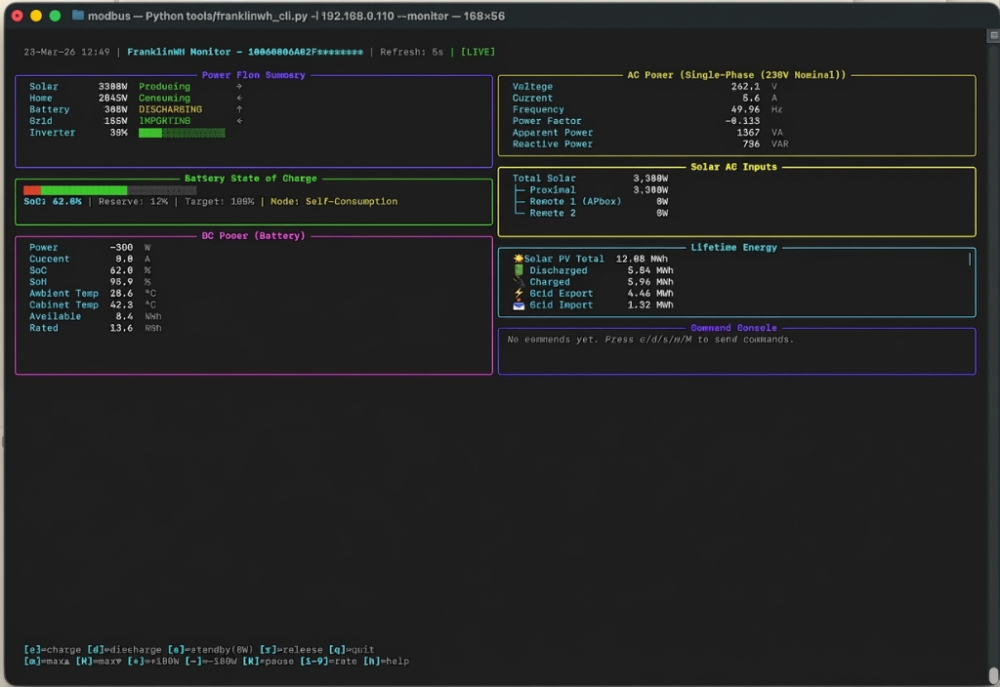

# TUI Monitor Guide

The FranklinWH CLI includes a fully interactive Terminal User Interface (TUI) dashboard. It provides low-level visualization and control over the aGate in a single, continuously updating screen.



## Why use the TUI Monitor?

When debugging Modbus integrations, writing local automation scripts (like Home Assistant rules), or simply monitoring your home's energy flow, latency matters. 

The FranklinWH App and Cloud API fetch telemetry on roughly 30-second cycles. In contrast, the TUI Monitor connects directly to the aGate on your local network, pulling real-time, sub-second (configurable) metrics. 

This gives you immediate visual feedback. If you send a command to discharge 2000W to the grid, the TUI will show the battery ramp up, the grid export metric climb, and the AC current spike instantly. It is an indispensable safety and debugging tool when taking direct control of your energy hardware.

---

## How to Access

```bash
# Requires the [monitor] extra dependency (Textual):
# pip install "franklinwh-modbus[monitor]"

CLI="python3 tools/franklinwh_cli.py -i YOUR_AGATE_IP"

# Launch the monitor
$CLI --monitor
```

---

## Dashboard Sections

The dashboard decomposes the raw SunSpec registers into logical, human-readable components spanning the entire physical system:

1. **Power Flow Summary**: A high-level overview showing the flow of Power between Solar, Home, Battery, and Grid. It clearly indicates if the battery is `CHARGING`, `DISCHARGING`, or `IDLE`, and if the grid is `IMPORTING`, `EXPORTING`, or `BALANCED`. It also shows the current inverter capacity utilization.
2. **Battery State of Charge**: A visual progress bar detailing your current SoC, overlaid with the reserve limits (Emergency or Self-Consumption thresholds), any target SoC you have set, and the active Work Mode (e.g., `Self-Consumption`).
3. **DC Power (Battery)**: Deep-dive battery statistics (Model 714). This exposes internal metrics like State of Health (SoH), accurate DC wattage, Ampere flow, internal Cabinet/Ambient temperatures, and the underlying rated vs available kWh capacity.
4. **AC Power**: Detailed grid integration stats (Model 701) including Voltage, Current, Frequency, Power Factor, Apparent (VA), and Reactive (VAR) Power. Highly useful for diagnosing grid stability issues or volt-var curve responses.
5. **Solar AC Inputs**: Exposes raw solar production (Model 502) including Proximal (direct) inputs and Remote devices (like aPbox). 
6. **Lifetime Energy**: Cumulative counters tracking the absolute Wh energy moved across all nodes since the battery was installed.
7. **Command Console**: Displays the last executed interactive action and any resulting output.

---

## Interactive Controls

The TUI isn't just a read-only dashboard—it accepts live keyboard inputs to issue Modbus control commands in real-time. The active hotkeys are displayed at the bottom of the screen.

### Core Control Operations

- <kbd>c</kbd> **Charge**: Prompts for a wattage to force-charge the battery (or uses the max rate if enter is hit).
- <kbd>d</kbd> **Discharge**: Prompts for a wattage to force-discharge the battery to the home/grid.
- <kbd>s</kbd> **Standby**: Commands `0W` on the battery, forcing it to remain completely idle. The grid will immediately take over all home loads.
- <kbd>r</kbd> **Release**: Sends a `WSetEna=0` command, relinquishing Modbus control. The aGate will instantly resume its native work mode (e.g., Self-Consumption).

### Power Stepping

When the battery is under manual Modbus control (via Charge, Discharge, or Standby), you can live-step the power output:

- <kbd>+</kbd> **Increase**: Adjust the setpoint by `+100W` (more discharge / less charge).
- <kbd>-</kbd> **Decrease**: Adjust the setpoint by `-100W` (less discharge / more charge).
- <kbd>m</kbd> **Max Charge**: Instantly forces the battery to its maximum hardware charge limits.
- <kbd>M</kbd> **Max Discharge**: Instantly forces the battery to dump absolute maximum power.

### Display Controls

- <kbd>R</kbd> **Pause/Resume**: Freezes the display polling. Useful if you want to capture a screenshot or lock a specific anomaly on the screen.
- <kbd>1</kbd> - <kbd>9</kbd> **Refresh Rate**: Instantly change the network polling interval. `1` polls every 1 second (high traffic, real-time), while higher numbers poll less frequently.
- <kbd>h</kbd> **Help**: Toggles an overlay explaining every command.
- <kbd>q</kbd> **Quit**: Exits the monitor and safely disconnects.
