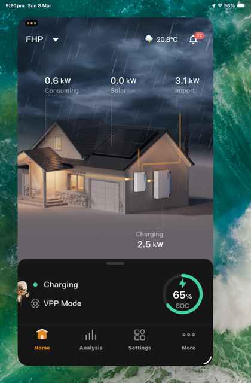

# What is Modbus TCP?

**Modbus TCP/IP** is an open industrial communication protocol that maps the standard Modbus data model onto Ethernet networks using TCP/IP for transport. It uses a client/server model, enabling reliable messaging for industrial automation, where controllers (clients) request data from instruments or sensors (servers) via IP addresses, typically on port 502.

In Modbus, data transactions are traditionally stateless, making them highly resistant to disruption from noise and requiring minimal recovery information to be maintained at either end.

---

## ⚠️ The Reality of Modbus: Challenges & Complexity

While Modbus is a universal standard, it is notoriously difficult for newcomers to grasp and work with effectively:

1. **Many Variants & Implementations**: There is no "one true way" Modbus is implemented. Data types, register alignments, byte orders (endianness), and scaling factors differ wildly between devices.
2. **Minimal Conformance**: The SunSpec Alliance defines standards for solar and storage Modbus interfaces, but vendors often only implement the bare minimum (or less).
3. **Lack of Documentation**: Generalised documentation from the SunSpec Alliance and hardware vendors often provides few (if any) examples or real-world use-case explanations.
4. **Archaic & Terse Interfaces**: The protocol is low-level. You are reading from and writing to raw memory registers (numbered addresses), not interacting with modern, self-describing JSON APIs. It is not for the faint-hearted.
5. **High Risk Factor**: All vendors implement guard-rails and safety mechanisms, but improper settings—especially concerning power limits or mode switching—carry real risks. Modifying these registers must be done with proper controls and consideration of the risks (e.g., causing damage, or leaving the device in an improper, invalid, or run-away state).

---

## ✅ Modbus TCP vs Cloud API

Both this library and [franklinwh-cloud](https://david2069.github.io/franklinwh-cloud/) control the same hardware — they use different paths to get there. Despite its complexity, Modbus TCP offers massive advantages for local automation.

| Aspect | Modbus TCP (this library) | Cloud API (franklinwh-cloud) |
|--------|--------------------------|------------------------------|
| **Latency** | ~50ms (LAN direct) | ~500ms–2s (internet via CloudFront) |
| **Availability** | Works offline and off-grid | Requires internet + FranklinWH servers |
| **Control path** | Direct register writes to aGate | Cloud-mediated commands via MQTT |
| **Data freshness** | Real-time (configurable poll rate) | ~30s telemetry intervals |
| **Setup** | Requires installer to enable Modbus TCP | Works with standard FranklinWH credentials |
| **Battery control** | ✅ Charge / discharge / standby | ✅ Charge / discharge / standby |
| **TOU schedules** | ⚠️ Read-only (extension registers) | ✅ Full read/write |
| **Mode switching** | ⚠️ Requires SPAN unlock for writes | ✅ Full support |
| **Risk profile** | Direct hardware access — mistakes persist | Cloud-mediated — safer guardrails |

!!! tip "When to use which"
    **Modbus TCP** for real-time monitoring, low-latency VPP/arbitrage control, and offline/off-grid operation. **Cloud API** for TOU schedule management, remote access from outside your LAN, and when Modbus TCP is not enabled on your aGate.

### Key Benefits of Modbus TCP

- **No Vendor Lock-in or Deprecation Risks**: It doesn't rely on cloud subscription licenses, doesn't require an active internet connection, and isn't subject to unexpected breaking changes by the vendor.
- **Industry Standard**: It is based on non-proprietary, ubiquitous open standards.
- **Direct Local Network Control**: Operation is entirely localized to your LAN.
- **Lightning Fast**: Response times are nearly instantaneous (milliseconds) compared to the latency of round-trip cloud API polling.
- **Powerful Raw Control**: Once mastered, the Modbus model provides dedicated functions to directly and optimally control your device exactly as the vendor's own hardware does.
- **Direct Battery & Power Management**: Allows for direct battery limits and mode manipulation. While there are some significant limits in the specific FranklinWH implementation, the available control is still highly effective and worth using.

---

## The SunSpec Alliance

The [**SunSpec Alliance**](https://sunspec.org) is a non-profit industry alliance that defines open standards for solar, storage, and smart energy interoperability.

- **SunSpec Information Model** — standardised register maps for Distributed Energy Resources (DER). Each "model" defines a block of registers with fixed addresses, data types, and scale factors
- **700-series models** — DER devices (inverters, batteries, grid interfaces). This is what the aGate implements
- **PICS** (Protocol Implementation Conformance Statement) — a vendor's formal declaration of which models and fields they support. FranklinWH's PICS covers Models 1, 701–715
- **Conformance testing** — SunSpec certifies devices against their test suites, but real-world implementations frequently deviate from the specification

---

## ⚠️ FranklinWH Specifics: Quirks & Disadvantages

Understanding a vendor's implementation limitations is critical. Devices are evaluated against SunSpec PICS (Protocol Implementation Conformance Statements), which show exactly which models and registers are actually supported.

However, specific to the **FranklinWH implementation**, there are notable friction points you must account for:

- **App Sync & Extension Registers**: Many core functions rely on proprietary extension registers (in the `15500+` range) that provide non-standard functions unique to FranklinWH. Without using these, your integration will conflict with the operating state of the FranklinWH Mobile App and Installer website, meaning it cannot provide the same view, or sync set values correctly.
- **Gateway Commandeering ("VPP Mode")**: Issuing remote Modbus TCP energy commands (like forcing charge/discharge) temporarily commandeers the aGate. During this time, you lose manual control in the FranklinWH app, and the app will override its normal display to show **"VPP Mode"**.

  { width="300" }
- **Sustained Control Risks**: The Modbus interface lacks full exposure of sustained operational controls. This poses a potential risk—developers and users must be highly aware of how they manage state to avoid leaving the system in an unintended "runaway" or stuck condition after a remote operation.
- **Missing Accessories**: The Modbus interface currently suffers from a lack of exposure for other FranklinWH accessories. You cannot monitor or control the Generator Module, Smart Circuits, or Vehicle-to-Load (V2L) mode via Modbus.
